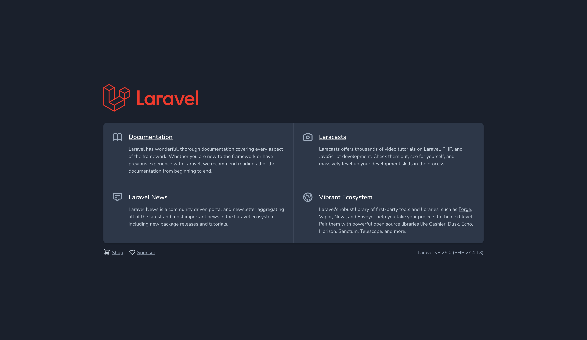

Now to build a RESTful application programming interface (API) using [Laravel 8.x](https://laravel.com/) ```learning-by-doing```. 
REST stands for REpresentational State Transfer, it's an abstract architectural style to guide the design and development architecture for the World Wide Web. RESTful is a set of constraits to architectural styles and the design of network-based software RESTful systems, created by computer scientist Roy Fielding.

As mobile development and JavaScript frameworks become more popular, even the norm, it's nessarary to learn how RESTful APIs work.
Laravel an open-source PHP model–view–controller (MVC) web framework, created by Taylor Otwell, is an opinionated PHP application framework, as apposed to for example [ExpressJS](https://expressjs.com/) a minimal, 
un-opinionated JavaScript framework of which I will cover in another post.

In this post I am going to build an MVC - Web API with user authentination / registeration with login to a MySql DataBase (DB) using an ```.env``` file. I will also test with [Laravel testing PHPUnit](https://laravel.com/docs/8.x/testing). Feel free to explore / reference / download / clone or fork the repo [GitHub](https://github.com/StephOC/Laravel-API)

<div style="overflow-x:auto;">

| HTTP Verb | CRUD | Entire Collection (e.g. /users)| 	Specific Item (e.g. /user/{id})|
|:----------|:-----|:-------------------------------|:---------------------------------|
| POST 	    | Create | 	201 (Created), 'Location' header with link to /users/{id} containing new ID. |	404 (Not Found), 409 (Conflict) if resource already exists..|
| GET 	    | Read | 	200 (OK), list of users. Use pagination, sorting and filtering to navigate big lists.| 	200 (OK), single user. 404 (Not Found), if ID not found or invalid.|
| PUT 	    | Update/Replace | 	405 (Method Not Allowed), unless you want to update/replace every resource in the entire collection.| 	200 (OK) or 204 (No Content). 404 (Not Found), if ID not found or invalid.|
| PATCH 	| Update/Modify | 	405 (Method Not Allowed), unless you want to modify the collection itself. 	200 (OK) or 204 (No Content).| 404 (Not Found), if ID not found or invalid.|
| DELETE 	| Delete  |	405 (Method Not Allowed), unless you want to delete the whole collection—not often desirable.| 	200 (OK). 404 (Not Found), if ID not found or invalid.|

</div>

## Getting set up
I am working with a MacBook Pro for this project.
First install [Get Composer](https://getcomposer.org/) a dependency manager for PHP.
After composer installation run the below commands in your cli. For my cli I use [ohmyz](https://ohmyz.sh/)

```jsx
$ composer global require laravel/installer
$ laravel new myapp
$ php artisan serve
```

Laravel localhost development server started: 

```jsx
http://127.0.0.1:8000
```



Install MySQL, if using MacOS or Linux I recommend using [https://brew.sh/](https://brew.sh/) then run the below command.

```
 brew services start mysql
 ```
 
Create a DB for this app, credentials are in the ```.env``` the file located in the root of your project.
 
```jsx
DB_CONNECTION=mysql
DB_HOST=127.0.0.1
DB_PORT=3306
DB_DATABASE=myapp
DB_USERNAME=root
DB_PASSWORD=
```
 
I am using Migrate, it's like version control for our DB read more here [Laravel 8.x Migrations](https://laravel.com/docs/8.x/migrations)

```jsx php artisan make:model Article -m```

After running the above go to the migrations folder there should be a file like this ```2021_01_31_170103_create_articles_table.php```
To get up and running we need dummy data, I am seeding the DB with data so lets seed. Want to learn more about writing seeders read [https://laravel.com/docs/8.x/seeding](https://laravel.com/docs/8.x/seeding)

```jsx
php artisan make:seeder ArticlesTableSeeder
```

```jsx

<?php

namespace Database\Seeders;

use Illuminate\Database\Seeder;

class ArticlesTableSeeder extends Seeder
{
    /**
     * Run the database seeds.
     *
     * @return void
     */
    public function run()
    {
        // lets: truncate our existing records to start from scratch
        Article:truncate();

        $faker = \Faker\Factory::create();

        // lets create some articles in our DB
        for($i = 0; $i < 50; $i++) {
            Article::create([
                'title' => $faker->sentence,
                'body' => $faker->paragraph
            ]);
        }
    }
}
```

```jsx
php artisan make:seeder UsersTableSeeder
```
## Database Seeding
A quick way to populate our myapp DB. 

## Routes and Controllers
Routing RESTful routes Let’s create the basic endpoints for our application: create, retrieve the list, retrieve a single one, update, and delete. On the routes/api.php file, we can simply do this:
[https://laravelpackage.com/09-routing.html](https://laravelpackage.com/09-routing.html)


## Testing the Endpoints
Laravel lucky for us comes with PHPUnit ready to rock. 
Testing support with PHPUnit is installed by default with a phpunit.xml file, a root tests folder and a bunch of helper methods already set up for our application. 
Create the test folder (if it does not exist) then create TestController inside. [https://stackoverflow.com/a/43674716/1967126](https://stackoverflow.com/a/43674716/1967126)
basic endpoints for our application: create, retrieve the list, retrieve a single one, update, and delete. 
On the routes/api.php file, we can simply do this:

```
php artisan make:controller Article/ArticleController
```

HTTP Status Codes and the Response Format

Sending a Correct 404 Response
[Laravel Errors](https://laravel.com/docs/8.x/errors)
```jsx
<?php

namespace App\Exceptions;

use Throwable;
use Illuminate\Auth\AuthenticationException;
use Illuminate\Database\Eloquent\ModelNotFoundException;
use Illuminate\Foundation\Exceptions\Handler as ExceptionHandler;


class Handler extends ExceptionHandler
{
    /**
     * A list of the exception types that are not reported.
     *
     * @var array
     */
    protected $dontReport = [
        //
    ];

    /**
     * A list of the inputs that are never flashed for validation exceptions.
     *
     * @var array
     */
    protected $dontFlash = [
        'password',
        'password_confirmation',
    ];


    public function render($request, Throwable $exception)  {
        // replace 404  with a json response
        if ($exception instanceof ModelNotFoundException &&
            $request->wantsJson()) 
            {
            return response()->json([
                'error' => 'Resource not found' 
            ], 404);
        }

        return parent::render($request, $exception);
    }

    /**
     * Register the exception handling callbacks for the application.
     *
     * @return void
     */
    public function register()
    {
        $this->renderable(function(InvalidOrderException $e, $request) {
               return response()->json([
                'error' => 'resource not found'
            ], 404);
        });

        $this->reportable(function (Throwable $e) {
            //
        });
    }
}

```

| Reference | | 
|:----------|:-----|
| [Rendering Exceptions](https://laravel.com/docs/8.x/errors#rendering-exceptions) | [Laravel errors configuration](https://laravel.com/docs/8.x/errors#configuration) | 
| [middleware](https://laravel.com/docs/8.x/middleware)| [Closure]( https://stackoverflow.com/a/47348663/1967126) | 	
| [add Throwable](https://laracasts.com/discuss/channels/laravel/laravel7-upgrade-fails-php-fatal-error-declaration-of-appexceptionshandlerreportexception-dollar-exception-must-be-compatible-wizh) | [SO brew install mysql on macOS](https://stackoverflow.com/a/6378429/1967126) | 	
| [Laravel passport](https://laravel.com/docs/5.4/passport)	| [Laravel 8.x Migrations](https://laravel.com/docs/8.x/migrations) | 	

