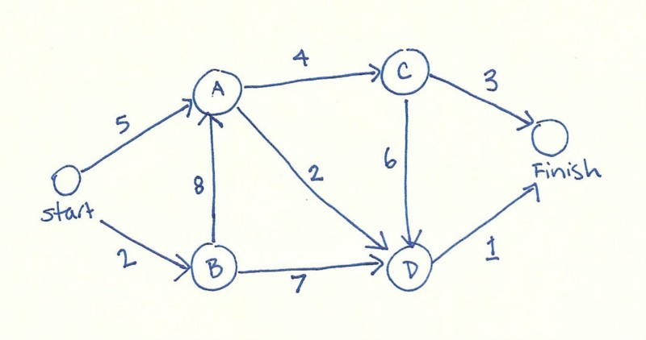

## Algorithms written in JS:

Vinilla JavaScript (JS) Algorithms are repeatable? The following are some Algorithms I wrote in JS. 

1. <a href="#two-sum">Two Sum</a>
2. <a href="#fibonacci">Fibonacci</a> - learn recursion
3. <a href="#fizzBuzz">Fizzbuzz</a> - little fun test
4. <a href="#dijkstra">Dijkstra</a> - shortest path between nodes
5. <a href="Ransom">Harmless Ransom Note use Big O notation</a>
6. Palindrome - String & array manipulation - String and array methods
7. Caesar's Cipher - encryption
8. Reverse string

## Write Algorithms & write them in JS:
I love to cook delicious food while figuring out new recipes. Algorithms for me are like programming recipes. As with recipes I Read, Cook, Eat, Tweak & Repeat this concept I follow with algoritms Read, Write, Run, Tweak & Repeat.

In my humble opinion, a good way to improve one's cooking skills is to take recipes and create your own either by tweaking or taking the concepts of what one has learned and applying them to different ingredients, in this post different programming languages.

As with my cooking, my programming and problem solving I hopw will improve by learning algorithms, these are some [JavaScript (JS) algorithms](https://github.com/theWhiteFox/algorithms-in-js) that I will understand, not just do. JS([ES6](https://hacks.mozilla.org/category/es6-in-depth/))

In this post I chose JS as the language to learn the below algorithms because it's modern, fun, always evleving and most importantly the language of the web.

### Using Big O Notation

A way to test time & space of an algorithm.

"Big O notation is a mathematical notation that describes the limiting behavior of a function when the argument tends towards a particular value or infinity." Wikipedia

### <a name="two-sum"></a>Two Sum

Check an array for the sum of two values using Big O notation looping through the array twice to find a pair.

The first algorithm will be a JS `function twoSumBrute` that takes two parameters, a numbers array `arr` and a sum value `sum`.
`twoSumBrute` returns a of pair indices from `arr` that add up to the `sum` value, function parameter.

The first attempt will use brute force O(n2). The arr passed in has already been defined within the JS code as `const arr = [3, 7, 11, 15];`.

```jsx
// Brute Two Sum return indices O(n)2
// returns a of pair indices from `arr`
// that add up to the `sum` parameter
const arr = [3, 7, 11, 15];
const sum = 10;

const twoSumBrute = (arr, sum) => {
  const sums = [];

  // check first element in arr
  for (let firstElement = 0; firstElement < arr.length; firstElement++) {
    // check second element in arr
    for (let secondElement = 0; secondElement < arr.length; secondElement++) {
      if (arr[firstElement] + arr[secondElement] === sum) {
        sums.push(arr[firstElement] + arr[secondElement]);
      }
    }
  }
  return sums;
};

twoSumBrute(arr, sum);
```

A faster solution would be linear time using using a [Hash table](https://en.wikipedia.org/wiki/Hash_table) instead of the brute force algorithm above ☝️.

```jsx
// faster Two Sum using hashTable
const arr = [3, 7, 11, 15];
const sum = 10;

const twoSumHash = (arr, sum) => {
  const sums = [];
  const hashTable = {};

  // check first element in arr
  for (let firstElement = 0; firstElement < arr.length; firstElement++) {
    const sumMinusElement = sum - firstElement[i];
    // check second element in arr
    for (let secondElement = 0; secondElement < arr.length; secondElement++) {
      if (hashTable[sumMinusElement.toString] !== undefined) {
        sums.push(arr[firstElement], sumMinusElement);
      }

      // add the current number to the hash table
      hashTable[arr[i].toString()] = arr[i];
    }
  }
  return sums;
};

twoSumHash(arr, sum);
```

### <a name="fibonacci"></a>Fibonacci

<p>
  Fibonacci was a mathematician who developed the Fibonacci sequence, such that
  each number is the sum of the two preceding ones. The Fibonacci Sequence is
  found all throughout nature, too. It is a naturally occurring pattern. My
  first learning of Fibonacci was in nature as part of my art studies, I drew a
  Nautilus shell.
</p>


Fibonacci using while loops, recursion O(2^n) Memoization

```jsx
(function () {
  // Big O
  // 1, 1, 2, 3, 5, 8, 11
  function fibonacci(num) {
    var a = 1,
      b = 0,
      temp2;

    while (num > 0) {
      temp2 = a;
      a = a + b;
      b = temp2;
      num--;
      console.log(temp2);
    }
    return b;
  }
  fibonacci(7);

  const basicFib = () => {
    let first = 1,
      second = 0,
      answer = first + second;

    while (answer < 10) {
      console.log(answer);
      second = first;
      first = answer;
      answer = first + second;
    }
    basicFib();
  };
})();
```

### <a name="fizzBuzz"></a>Fizzbuzz

An algorithm sometimes used as a basic interview test.

```jsx
// FizzBuzz
// modulus operator
console.log("modulus operator: 7 % 3 = " + (7 % 3));

function fizzBuzz(num) {
  for (var i = 1; i <= num; i++) {
    if (i % 15 === 0) console.log("FizzBuzz");
    else if (i % 5 === 0) console.log("fizz");
    else if (i % 3 === 0) console.log("Buzz");
    else console.log(i);
  }
}

fizzBuzz(20);

// Dijkstra’s Algorithm
const problem = {
  start: { A: 5, B: 2 },
  A: { C: 4, D: 2 },
  B: { A: 8, D: 7 },
  C: { D: 6, finish: 3 },
  D: { finish: 1 },
  finish: {},
};
```

### <a name="dijkstra"></a>Dijkstra

<p>Dijkstra an algorithm for finding the shortest paths between nodes in a graph.</p>



```jsx
// Dijkstra’s Algorithm
const problem = {
  start: { A: 5, B: 2 },
  A: { C: 4, D: 2 },
  B: { A: 8, D: 7 },
  C: { D: 6, finish: 3 },
  D: { finish: 1 },
  finish: {},
};

// implementing the algorithm
const lowestCostNode = (costs, processed) => {
  return Object.keys(costs).reduce((lowest, node) => {
    if (lowest === null || costs[node] < costs[lowest]) {
      if (!processed.includes(node)) {
        lowest = node;
      }
    }
    return lowest;
  }, null);
};

// func that returns the min cost and path to reach finish
const dijkstra = (graph) => {
  // track lowest cost to reach each node
  const costs = Object.assign({ finish: Infinity }, graph.start);

  // track paths
  const parents = { finish: null };

  // add children of the start node
  for (let child in graph.start) {
    parents[child] = "start";
  }

  // track nodes that have already been processed
  const processed = [];

  // get the cost of the current node
  let node = lowestCostNode(costs, processed);

  // get all the children of the current
  while (node) {
    let cost = costs[node];
    let children = graph[node];
    // loop through each of the children
    for (let n in children) {
      let newCost = cost + children[n];
      if (!cost[n]) {
        costs[n] = newCost;
        parents[n] = node;
      }
      if (costs[n] > newCost) {
        costs[n] = newCost;
        parents[n] = node;
      }
    }
    // push to processed data structure
    processed.push(node);
    node = lowestCostNode(costs, processed);
  }

  let optimalPath = ["finish"];
  let parent = parents.finish;

  while (parent) {
    optimalPath.push(parent);
    parent = parents[parent];
  }

  optimalPath.reverse(); // reverse array to get order

  const results = {
    distance: costs.finish,
    path: optimalPath,
  };
  return results;
};

console.log(dijkstra(problem));

// Object { distance: 12, path: […] }
// distance: 12
// path: […]​
// 0: "parent"
// 1: "parent"
// 2: "parent"
// 3: "finish"
// length: 4
```

| Reference                                                                                                                    |                                                                                                                               |
| :--------------------------------------------------------------------------------------------------------------------------- | :---------------------------------------------------------------------------------------------------------------------------- |
| [big O cheat sheet](https://www.bigocheatsheet.com/)                                                                         | [beginners guide to big O notation](https://rob-bell.net/2009/06/a-beginners-guide-to-big-o-notation/)                        |
| [algorithms important](https://www.quora.com/Why-are-algorithms-so-important)                                                | [SO fibonacci recursive](https://stackoverflow.com/questions/8845154/how-does-the-the-fibonacci-recursive-function-work)      |
| [Dijkstras](https://hackernoon.com/how-to-implement-dijkstras-algorithm-in-javascript-abdfd1702d04)                          | [thatjsdude check Palindrome](https://thatjsdude.com/interview/js1.html#checkPalindrome)                                      |
| [JS algorithms from scratch](https://medium.com/@renhades/learning-algorithm-in-javascript-from-scratch-8247f89a8606)        | [palindromelist](http://www.palindromelist.net/)                                                                              |
| [medium Tim Severien substitution cipher JS](https://medium.com/@TimSeverien/substitution-cipher-in-javascript-d530eb2d923d) | [Reverse a string](https://medium.com/sonyamoisset/reverse-a-string-in-javascript-a18027b8e91c)                               |
| [You Dont Know JS](https://github.com/getify/You-Dont-Know-JS)                                                               | [freecodecamp js arrayreverse tut](https://www.freecodecamp.org/news/javascript-array-reverse-tutorial-with-example-js-code/) |
| [theWhiteFox algorithms-in-js](https://github.com/theWhiteFox/algorithms-in-js)                                              |
