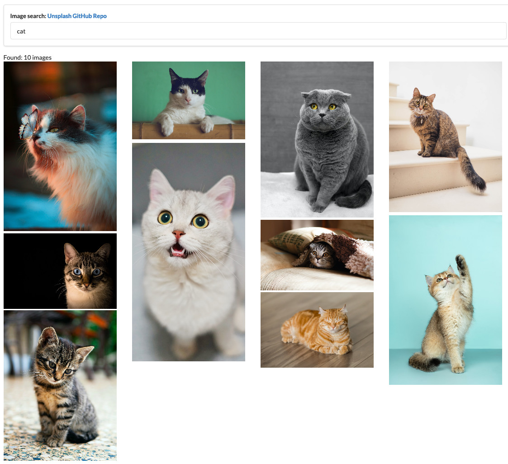
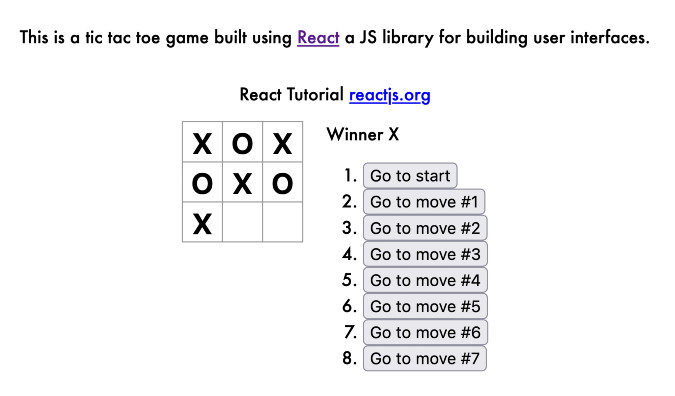

## Why Learn React?

React a JavaScript (JS) library written and supported by facebook. 
React is a fun Component-Based modern JavaScript library for building complex web apps. 

What is React ?

How does it compare to other JS frameworks ?

I want to learn how React works so I set up & built out these repos:  

- [search unsplash](https://github.com/theWhiteFox/react-basics-advanced)

- [https://github.com/theWhiteFox/react-tic-tac-toe](https://github.com/theWhiteFox/react-tic-tac-toe)

- [https://github.com/theWhiteFox/React-Apollo-Tutorial](https://github.com/theWhiteFox/React-Apollo-Tutorial)
- [https://github.com/theWhiteFox/slack-clone-server](https://github.com/theWhiteFox/slack-clone-server)
- [https://github.com/theWhiteFox/create-react-app/tree/gh-pages](https://github.com/theWhiteFox/create-react-app/tree/gh-pages)

What I will cover:

- Getting up and running
- Components
- State
- class components
- component method
- setState
- Props
- constructor
- functionial components
- render method

| My workspace                                   |                                                                             |                                                    |
| ---------------------------------------------- | --------------------------------------------------------------------------- | -------------------------------------------------- |
| 👜 Lappy: MacBook Pro                          | 🏝️ macOS: Mojave                                                            | 🐚 CLI: iTerm - zsh                                | 📓 Editor: MScode |
| 📔 Online Editor: [prose.io](http://prose.io/) | ⛪ Browser: [Firefox Dev](https://www.mozilla.org/en-US/firefox/developer/) | 🏭 Deployment: [Netlify](https://www.netlify.com/) |

| Reference                                                                                                                  |                                                                             |
| :------------------------------------------------------------------------------------------------------------------------- | :-------------------------------------------------------------------------- |
| [freecodecamp JS skills react](https://www.freecodecamp.org/news/javascript-skills-you-need-for-react-practical-examples/) | [Udemy React Redux online coure](https://www.udemy.com/course/react-redux/) |
| [https://babeljs.io/](https://babeljs.io/) | [react-component](https://reactjs.org/docs/react-component.html) |
| [state-and-lifecycle](https://reactjs.org/docs/state-and-lifecycle.html) | [github facebook react](https://github.com/facebook/react/) |
| [medium freecodecamp react is taking over front end why](https://medium.freecodecamp.org/yes-react-is-taking-over-front-end-development-the-question-is-why-40837af8ab76) | [5 things to learn before learning React](https://www.oreilly.com/content/5-things-to-learn-before-learning-react/) |
| [https://reactjs.org/docs/forms.html](https://reactjs.org/docs/forms.html) | [https://reactjs.org/docs/uncontrolled-components.html](https://reactjs.org/docs/uncontrolled-components.html) |
| [axios](https://github.com/axios/axios) | [https://reactjs.org/docs/refs-and-the-dom.html](https://reactjs.org/docs/refs-and-the-dom.html) |
| [https://www.freecodecamp.org/news/learn-react-basics/](https://www.freecodecamp.org/news/learn-react-basics/) | [https://www.freecodecamp.org/news/react-beginners-guide/](https://www.freecodecamp.org/news/react-beginners-guide/)
