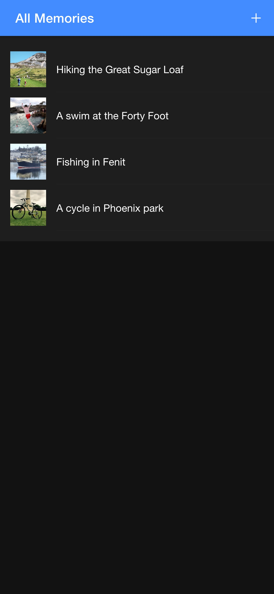
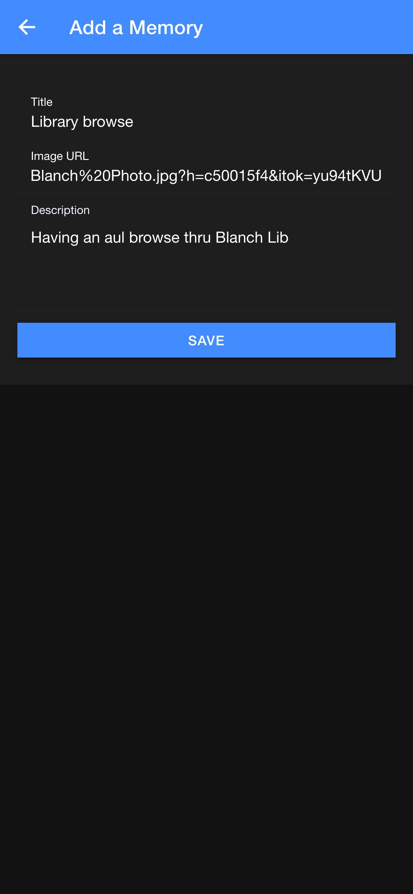
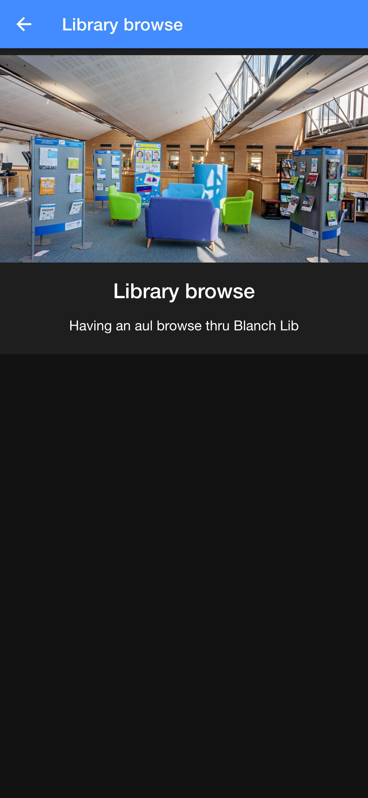
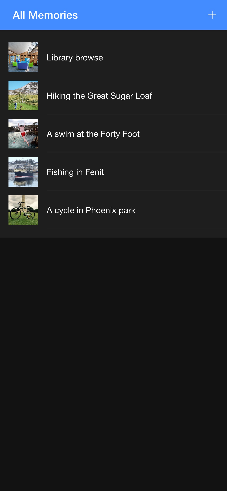
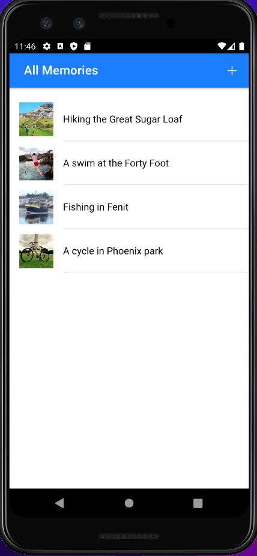
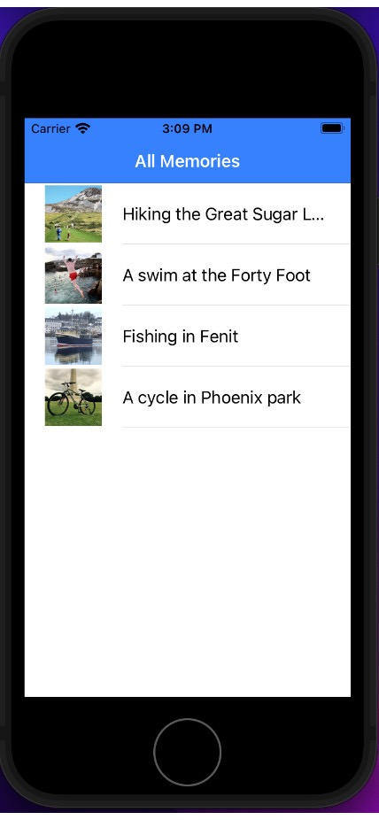

## Ionic to build Mobile Apps

iOS & Android are two main platforms for building mobile native applications (apps), it's software designed to run on a mobile devices such as a phone, tablet, or watch. These platfroms use programming languages Swift & Java to build native apps. Native mobile apps can be time consuming for a web dev if you have no expience or have not learned to program with Java, on an Android Software Development Kit (SDK) and on iPhone with Swift using Xcode. These languages are quite complex and verbose unlike JS which is a fun modern web language that as a Web Dev I use everyday.

## Ionic
What Ionic does it allows web developers to build a native app using the languages of the web: HTML, CSS, and JavaScript [Vanilla JS](http://vanilla-js.com/) or [TypeScript](https://www.typescriptlang.org/). Ionic is software open source, absolutely free to download and it's easy to get up and running quite quickly with a basic prototype.

In this post, we will build & deploy a native iOS & Android app from one codebase using Ionic. How Ionic works, using [Capacitor](https://capacitorjs.com/) creates a native container and runs our app within it, enabling full access to any native device features or APIs.

- PWA Progressive Web App giving you native mobile features
- Native APP - Native app features
- one code base one IDE vscode
- Built using JavaScript

Choose from JS frameworks such as Angular, React or Vue, with this app I will be choosing [Vue](https://vuejs.org/) with [Vuex](https://vuex.vuejs.org/).

Vue a reactive JS framework for building complex web apps my code [theWhiteFox ion-vue-app repo](https://github.com/theWhiteFox/ion-vue-app)

| My Set up MacOS              |                        |
| :--------------------------- | :--------------------- |
| Node Version Manager -v 0.38 | node -v v16.8          |
| npm -v 7.24                  | vue -V @vue/cli 4.5.13 | ionic -v 5.4.16 |  |


## Vue
Vue a reactive component based JS framework used to build complex web apps in the intance we are using it with Ionic to buld a native mobile app

### Component
Vue components that don't care a about the data passed in.

### View
Pages that render the content

## Vuex
Create a store object to save the state of the app data with "A Single Source of Truth" The Flux pattern in VueJS, building a simple store

### State
Store "single source of truth." [Vuex state](https://vuex.vuejs.org/guide/state.html)

### Getter

### Mutation

### Action

## Firefox Development

Start by running the below in your cli.

```jsx
ion-vue-app on  main is 📦 v0.0.1 via ⬢ v16.10.0
➜ ionic serve
```

The follow screenshots were taken in [Firefox Dev](https://www.mozilla.org/en-US/firefox/developer/) responsive design mode.

Img 1 select a memory from the memories list on home page to dispaly that memories' detals in the memories details page.

<ul
  style="padding: 0;
    list-style-type: none;"
>
  <li style="float: left;width: 45%;list-style-type:none;">
    
    <figcaption style="margin-bottom:8%">Img.1: Home Page</figcaption>
  </li>
  <li style="float: left;width: 45%;list-style-type:none; margin-left:10%">
    
    <figcaption style="margin-bottom:8%">
      Img.2: Memory details page.
    </figcaption>
  </li>
</ul>

Adding a memory again on the homepage this time however we want ot add a memory by cliking the ➕ icon.
By doing this a add memory page is displayed and we then enter a memory with details.
The meory is then add to the the list and dispkayed on the homepage.

<ul
  style="padding: 0;
    list-style-type: none;margin:8% 0%"
>
  <li style="float: left;width: 45%;list-style-type:none;">
    
    <figcaption style="margin-bottom:8%">Img.3: Home Page</figcaption>
  </li>
  <li style="float: left;width: 45%;list-style-type:none;margin-left:10%">
    
    <figcaption style="margin-bottom:8%">Img.4: Create a memory.</figcaption>
  </li>
  <li style="float: left;width: 45%;list-style-type:none;">
    
    <figcaption style="margin-bottom:8%">
      Img.5: Enter memory details.
    </figcaption>
  </li>
  <li style="float: left;width: 45%;list-style-type:none;margin-left:10%">
    
    <figcaption style="margin-bottom:8%">
      Img.6: Home Page Memory List + memory.
    </figcaption>
  </li>
</ul>

Emulators Pixal 3 Android SDK and Xcode iPhone

<ul
  style="padding: 0;
    list-style-type: none;"
>
  <li style="float: left;width: 45%;list-style-type:none;">
    
    <figcaption style="margin-bottom:8%">Img.1: Android.</figcaption>
  </li>
  <li style="float: left;width: 45%;list-style-type:none; margin-left:10%">
    
    <figcaption style="margin-bottom:8%">Img.2: iOS.</figcaption>
  </li>
</ul>

### Axios Get

An asynchronos promised based HTTP client libaray. Handles HTTP requests and responses

```jsx
  actions: {
    getPosts() {
      axios
        .get("./dummy-data.json")
        .then((response) => {
          this.memories = response.data;
        })
        .catch((e) => {
          console.log(e);
        });
    },
  },
```

## Capacitor JS

Create a native mobile app using a wrapper to distrube, slight performance loss.

`ionic integrations enable capacitor`

`npm install @capacitor/cli@latest @capacitor/core@latest`

`ionic capacitor add android`

`ionic capacitor add ios`

`npx cap open android`

[https://capacitorjs.com/docs/getting-started/environment-setup](https://capacitorjs.com/docs/getting-started/environment-setup)

[https://cocoapods.org/](https://cocoapods.org/)

`sudo gem install cocoapods`

`npx cap open ios`

[Capacitor JS](https://capacitorjs.com/)

TypeScript removed
[TypeScriptLang compiler options](https://www.typescriptlang.org/docs/handbook/compiler-options.html)

## Styling

[MDN Using CSS custom properties](https://developer.mozilla.org/en-US/docs/Web/CSS/Using_CSS_custom_properties)
[npm.io css variables](https://npm.io/search/keyword:css-variables)

| Reference                                                                                                                 |                                                                                                                               |
| :------------------------------------------------------------------------------------------------------------------------ | :---------------------------------------------------------------------------------------------------------------------------- |
| [Ionic & Vue.js - Full Tutorial (Build a Complete App)](https://youtu.be/mQ4zmFy4d7Y)                                     | [ionic vue navigation](https://ionicframework.com/docs/vue/navigation)                                                        |
| [Axios](https://axios-http.com/) promise based HTTP client                                                                | [MDN Promise](https://developer.mozilla.org/en-US/docs/Web/JavaScript/Reference/Global_Objects/Promise)                       |
| [Medium vue-or-ionic-vue-dynamic-routes](https://medium.com/@dlodeprojuicer/vue-or-ionic-vue-dynamic-routes-4e1ca667dcd0) | [Digital Ocean js-intro-progressive-web-apps](https://www.digitalocean.com/community/tutorials/js-intro-progressive-web-apps) |
| [Aveek. getting-started-with-ionic-vue](https://home.aveek.io/blog/post/getting-started-with-ionic-vue/)                  |
